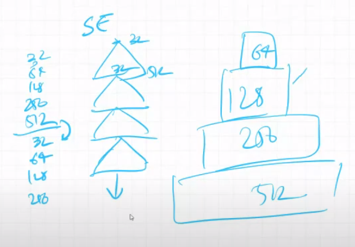

# Notes from session 2
nw - network

bw -b/w - between

info - information

diff - different

mm - memory

## Why do we use stride > 1

## Why we do not use max pooling a layer or two away from prediction?
Max pooling throws away 75% of info. CTO eg: throw away info at the point it is not required.
Once the info comes down to 7x7 etc, there is very less info which is redundant.
Also, we perform max pooling after we have extracted some features.

## How do we decide that max pooling is needed after these many layers?
Refer to session 1 which had the dog example. We zoomed into the dog image and looked at the lowest level at which a feature was available. This was a manual excercise, which helped us to make the first 5 layers and then we did the max pooling. For rest of arch, rohan asks us to repeat the same 5 layers with max pooling b/w them. More details later. Cant do max pool in first layer either. Maxpooling helps us to filter info instead of loosing info, by scaling in z axis. *check more about this*

## What are the (2) types of operation done by neural networks?

## What are the operations which we can do (on data and arch) to design our own image identification nw?
1. Zoom into the image and see the lowest features available.
2. Do not manipulate the size of image going IN the network. (you can do that outside your nw). We start loosing the info real soon because of that.
3. 

## Everyone starts at 224x224 or stops at 7x7?
To compare diff nw, everyone starts at 224x224. If someone started at 1000x1000 than they would have more features just to begin with.
At 7x7 there are enough features to fit more channels in the memory, so its prefferable than 5x5 or 3x3. Google 'pixal art'.

## Suppose we have 512 channels in input, how many are channels are probable in output?
1024, as we double the number of channels usually. We scale them up by 2^n as it has to fit in GPU, which will do similar to fit in its mm, rest will get wasted.
By 2x: 32 -> 64 -> 128 -> 256 -> 512 -> 1024

## What if we do by 4x: 32 -> 128 -> 512
Then network is not learning slowly. Although we can fit 512 channels, we are asking it to skip and make features faster.
This is going to be a balance of how good our hardware is. 2x is the max that we can do, or keep it same (Eg Resnet).

## How many layers in my nn?
Depends on your hardware (mm).

## What is squeeze and expand arch & how it fares against resnet?
Its as efficient as resnet but uses more mm, but stil covered to explain some concepts not covered in other arch.
Resnet on the other hand, is a kick arch. First full block at 64, next at 128 etc.
Resnet adds more layers in the block keeping channel size same. Since the channel size is same, the memory space needed is already known. That means we can then decide 
Resnet wants to go with 5x5, but then use 3x3 twice. 

## Bias
We are not going to use it much in this course. We when do batch normalization it just disappers. While calculating param, we dont consider bias.

## Memory requirement
For Resnet first block: (224x244x3 + 112x112x32 + 64x64x6) = 576512 pixels , this is the first block only.
If we input 1000 images, we will have 576MB memory for first block only, so in order to cut mm requirement, we use smaller batch size (of usually 32).
But it is important to pick images randomly from classes and shuffle them.
Second marraige example. going around 100 guests at one time to ask for feedback.

## Information in the image
Any random image will not have information. *check information entropy*
Just availability of pixels in form of image is not information. It means a lot of things. Only if you are structuring this, if you can arrange the pixels in a way that it can convey something, then the info goes up. We should also focus on the amount OF info OF the class. Eg: an image of dog with white background contains more info (of dog) than image of dog in nature.

https://www.youtube.com/watch?v=rlsOSGyJNOo
