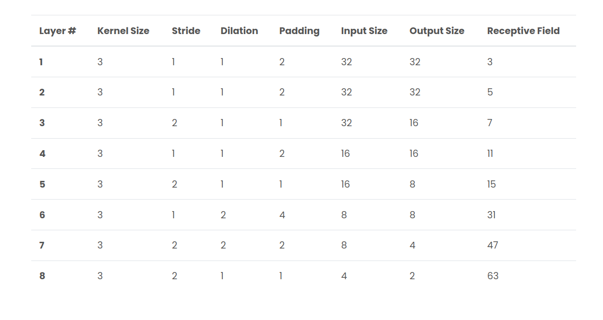
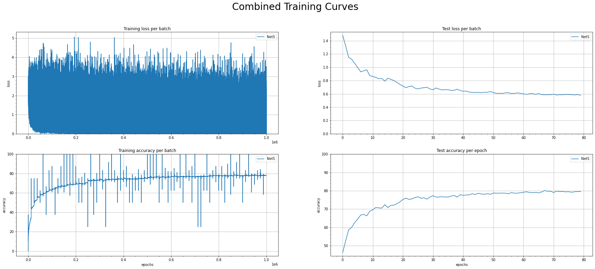

# Submission for Week 7 - Advanced Concepts

## Team Members

Bhaskar Gaur

Vidya Shankar had emergency surgery this week. He gave me some guidence on the phone.

https://github.com/vvshankar78/DeepLearning/blob/master/Extensive%20VisionAI-EVA6/week7/Session7_Step2.ipynb

### Objective:

---
#### Met
change the code such that it uses GPU.

change the architecture to C1C2C3C40  (No MaxPooling, but 3 3x3 layers with stride of 2 instead)

total RF must be more than 44 - Got **63**

one of the layers must use Depthwise Separable Convolution

one of the layers must use Dilated Convolution

use GAP (compulsory):- We removed the FC after GAP (optional)

parameter count of **85k**, Accuracy of **80%**

Used Transforms:
    horizontal flip (50% probability)
    scale (0.9 to 1.1)
    rotation (-5 to 5)
    translate/shift (0.1 for x/y)

#### Not Met
use albumentation library and apply:

    horizontal flip
    shiftScaleRotate
    coarseDropout (max_holes = 1, max_height=16px, max_width=1, min_holes = 1, min_height=16px, min_width=16px, fill_value=(mean of your dataset), mask_fill_value = None)

achieve 85% accuracy, as many epochs as you want. Total Params to be less than 200k. 

### The Journey:
1. Switched the notebook to use GPU.
2. Added normalization parameter calculation using both test and train data, used them in the transformation to get bump from 54% to 57% for 1000 images test accuracy.
3. Conducted experiments for architecture.

    i. Used large kernels of size 7 and 9 initially to mimic large receptive fields. Started with RF of 7 in first layer as 7 pixels were enough to get edges in CIFAR10 image.
    
    ii. Used a pyramid arch instead of sqeeze and expand this time.
    
    iii. The number of filters started with 16 -> 32 -> 64 -> 128. 256 was found overkill.
    
    iv. The final layer of 128 filters was changed to Depthwise Separable Convolution, and gave parameter count reduction from 155k to 85k.
    
    v. The layer with 64 filters was changed to dilation of 2, as it can get better idea of big picture when the parts of objects are found.
    
    vi. Final arch receptive field calculation (using [Fomoro AI Online Calculator](https://fomoro.com/research/article/receptive-field-calculator#3,1,1,SAME;3,1,1,SAME;3,2,1,SAME;3,1,1,SAME;3,2,1,SAME;3,1,2,SAME;3,2,2,SAME;3,2,1,SAME))
    
    
    
    
4. Added Batch Normalization. With Dropout of 10%, test accuracy reached 80% in 50 epochs.
5. Learning rate of 0.1 did not lead to loss reduction. So started with 0.01 and followed schedule of reduction at step of 20 with 0.5 gamma.
6. Added image transformations with a dropout of 5%: 

    i.  Kept having issues with albumenation during installation on local machine, so created a new virtual env for it. It uses torchvision 0.2 ver which caused env resolution issue with pytorch which was using 0.9/0.10 ver of torchvision. Next time will try on colab as well, and check basic examples.
    
    ii. In torchvision transforms, Horizontal flip was very successful.
    
    iii. Shear proved counterproductive, and was removed.
    
    iv. Rotate, scale and shift(translate) were added in moderation.
    
    v. Missed cutout.

7. Training charts:
    
    
### The learning
1. Keep experimenting with newer additions like image aug library on the side to avoid last minute surprise.
2. Whatever the network can achieve with dropout of 10%, gives the ballpark of what image augmentation can achieve.
3. Check in future if cutout can really outperform the above point.
4. New LR schedule need to be tried, which can increase and get us out of local minima.
    
